# SDLShooter
C++游戏开发的入门教程，利用SDL2（SDL3）开发一款太空战机类型的游戏

## 项目简介
此项目为教学演示用途，配套视频教程：[SDL2与太空战机](https://www.bilibili.com/video/BV1wSCFYQEyc/?share_source=copy_web&vd_source=38785218fa1d2c5dfde79f8b24baf0b6) 

提示：仓库中包含了所有课节的代码，你可以根据视频教程的进度查找对应的代码。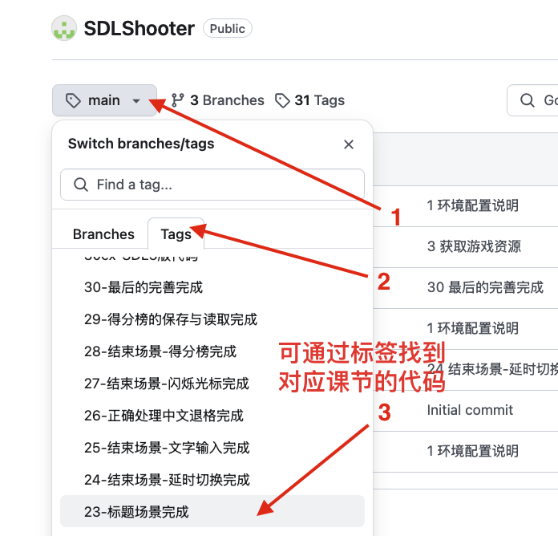
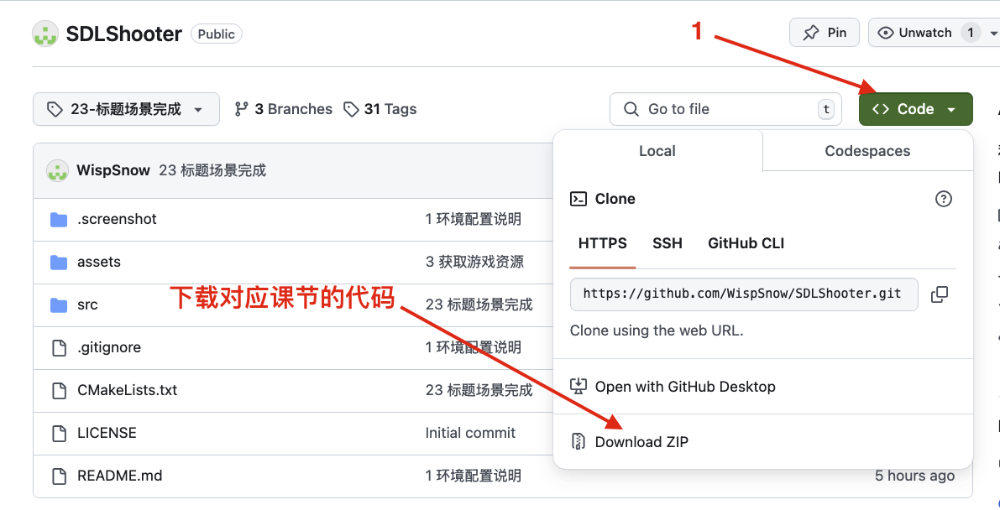

或者使用Git更加方便地查看代码，参考此教程：[利用Git快速查看课节代码](https://www.bilibili.com/video/BV1H7KGerEAa/)

本项目为CC0 1.0许可，这意味着你可以随意使用此代码且无需署名，但如果你给出Github链接或者视频教程的链接，我会非常感激。

## 游戏截图

<div style="display: flex; gap: 10px;">
  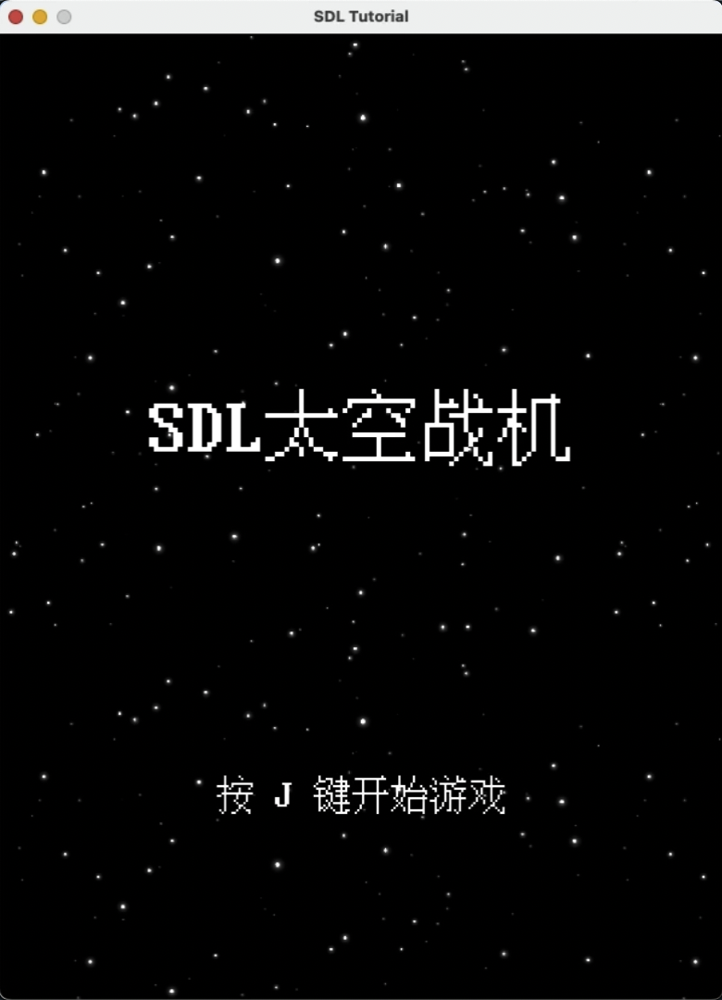
  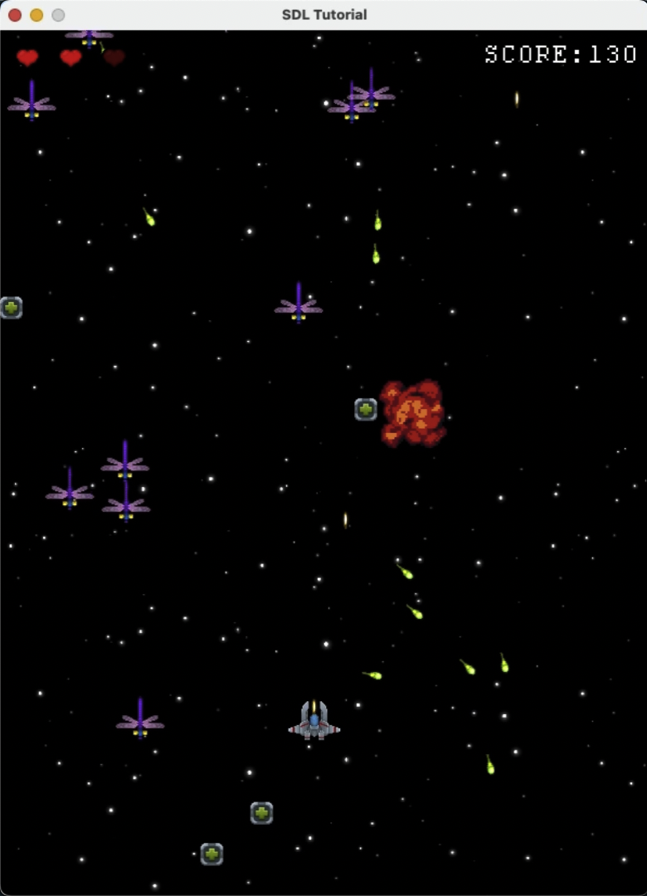
</div>
<div style="display: flex; gap: 10px;">
  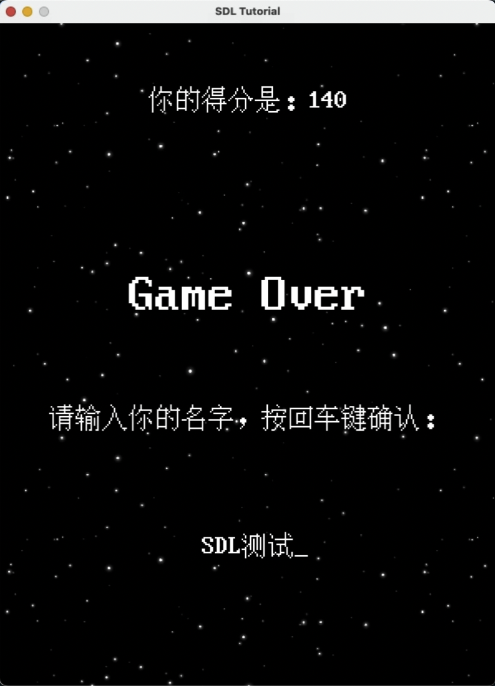
  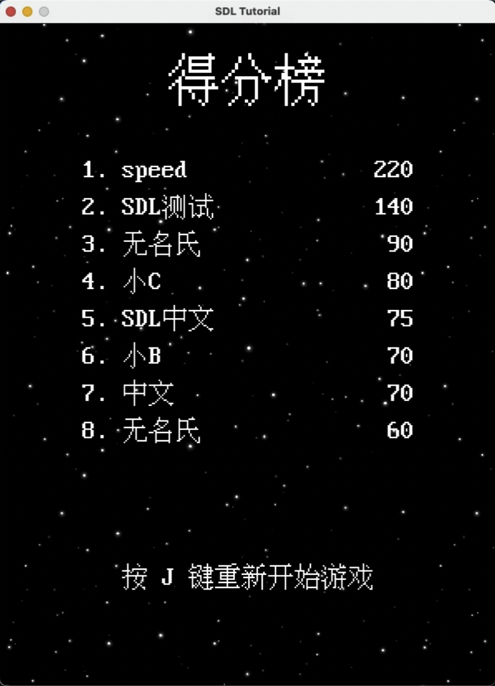
</div>

## 环境配置
请根据你自己的平台（Linux、MacOS、Windows）参考各自的配置方法。
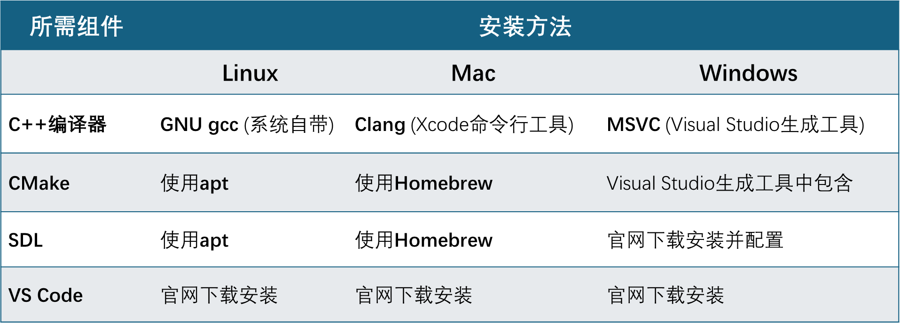
## Ubuntu Linux
1. 安装cmake和SDL相关库。打开终端，输入：
```bash
sudo apt install cmake libsdl2-dev libsdl2-image-dev libsdl2-mixer-dev libsdl2-ttf-dev
```
至此即完成配置。

### MacOS
1. 测试你的电脑是否安装了homebrew。终端输入：
	```bash
	brew --version
	```
	显示 `Homebrew (版本号)` 即表示已经安装，可以跳过第2步。否则需要进行第2步安装。
2. 安装brew：[官网](https://brew.sh/)、[国内安装方法](https://www.cnblogs.com/Wcowin/p/17062207.html)。安装完成后可重复第1步以测试是否安装成功。
3. 安装命令行工具。在终端内输入：
	```
	xcode-select --install
	```
	按照提示安装即可。如果显示 `... Command line tools are already installed. ...` 则表示之前已经安装了，可以继续往下执行。
4. 通过homebrew安装cmake和SDL相关库。终端输入：
	```bash
	brew install cmake sdl2 sdl2_image sdl2_mixer sdl2_ttf
	```
	提示安装完毕后即可完成配置。

### Windows
1. 安装Visual Studio 生成工具。首先打开[官网](https://visualstudio.microsoft.com/zh-hans/downloads/)，下拉网页找到“用于Visual Studio的工具”。展开后找到“Visual Studio 2022 生成工具”下载安装。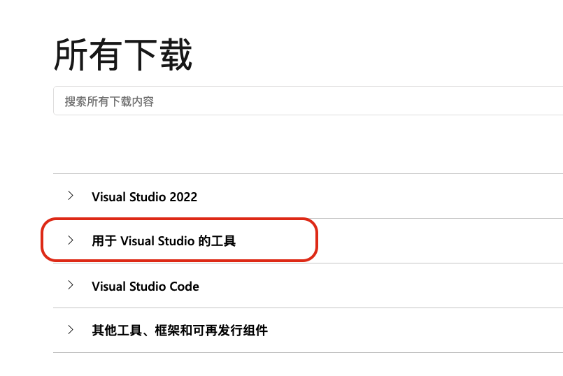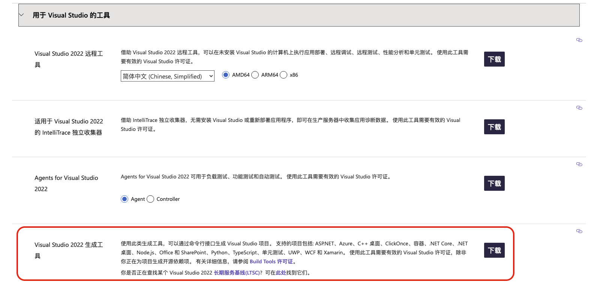
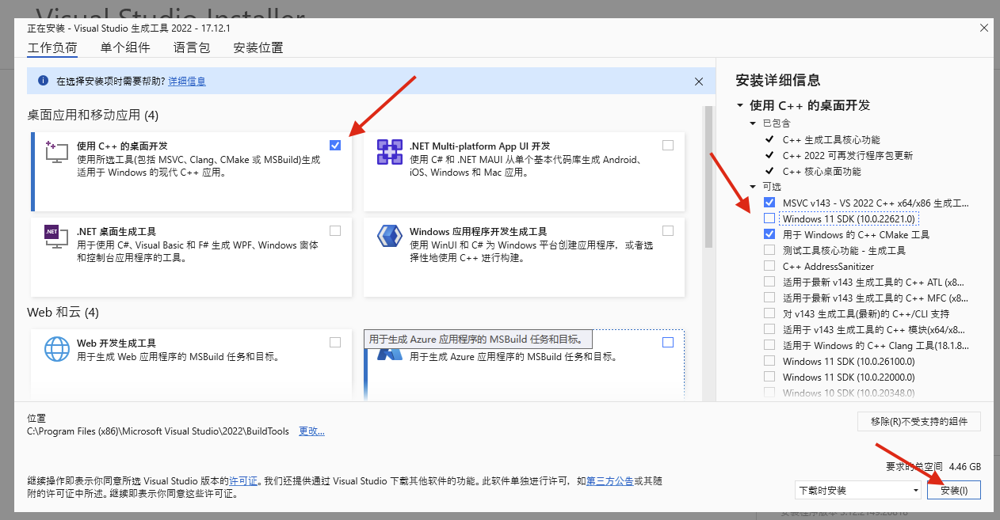

2. 分别下载[sdl2](https://github.com/libsdl-org/SDL/releases/)，[SDL2-image](https://github.com/libsdl-org/SDL_image/releases), [SDL2-mixer](https://github.com/libsdl-org/SDL_mixer/releases), [sdl2-ttf](https://github.com/libsdl-org/SDL_ttf/releases) 的msvc开发版。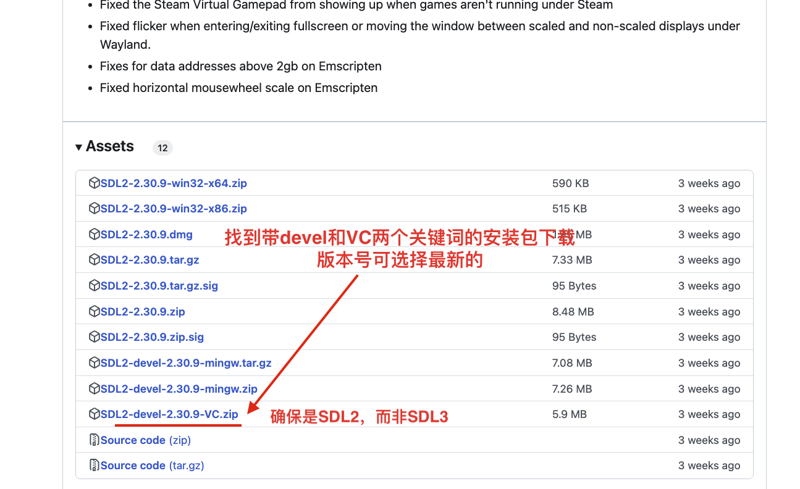 下载后将4个文件全部解压到任意指定文件夹中（例如 `C:\Library\SDL2`）。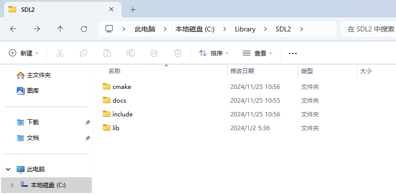

3. 设置环境变量，将上一步得到的`文件夹路径` 及 `文件夹路径\lib\x64` 添加到Path变量中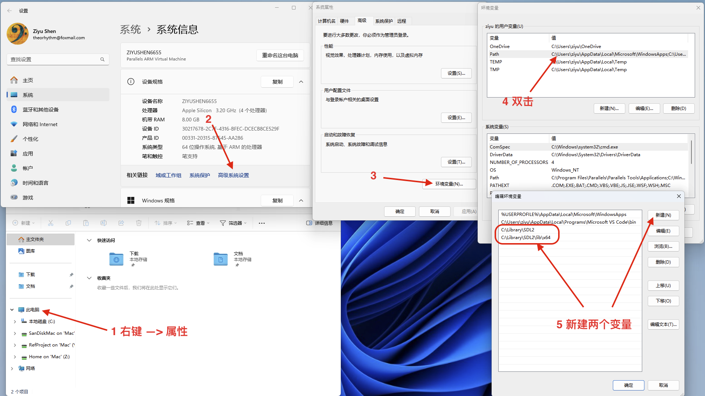

### 安装并配置Visual Studio Code编辑器
这一节所有平台都一样。
3. 打开[官网](https://code.visualstudio.com/)，选择对应平台的安装包下载安装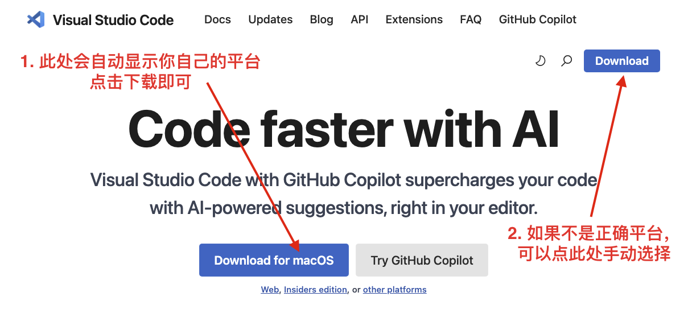
4. 在插件页面搜索“C++”，然后安装插件：`C/C++ Extension Pack` 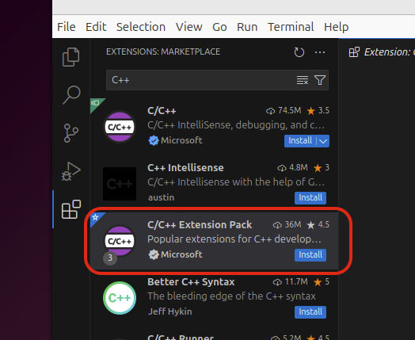 至此配置已经完成，后面几步可任选是否执行。
5. 可选：再次搜索Chinese，安装插件 `Chinese (Simplified) (简体中文)` ，重启后即可改成中文界面。
6. 可选：打开“设置”并搜索“cmake status bar”，将“Status Bar Visibility” 改为“visible”。（此设置可方便地更改编译模式为debug或者release等）。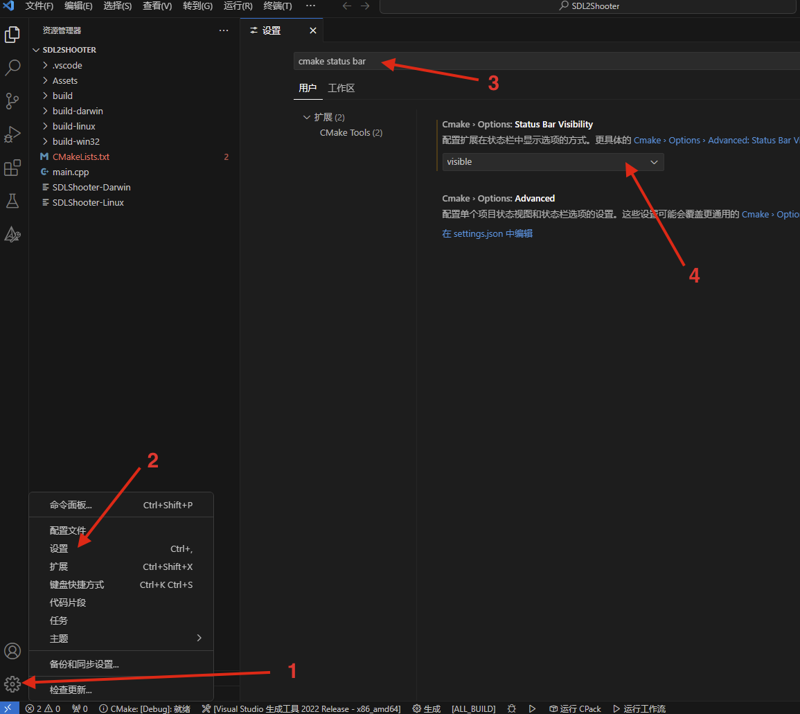
7. 可选：搜索安装AI辅助插件（选一个安装即可，以免冲突）。
	- 如果无法科学上网，推荐国内可用且下载量大的，例如 `CodeGeeX`，`fitten`等。
	- 如果能够科学上网，免费的推荐`Codeium`，付费的推荐 `Github Copilot`。


## 致谢
游戏素材来自于以下作者，均为CC0 1.0许可/无要求（你可以随意使用而无需署名），感谢他们的贡献：
- 图片素材：
  - https://anim86.itch.io/space-shoter-starter-pack
  - https://doshrosity.itch.io/32x32-health-ui
- 音效素材
  - https://enprimer.itch.io/spaceship-sound-effects-pack
- 音乐素材
  - https://leohpaz.itch.io/space-music-pack
- 字体素材
  - https://timothyqiu.itch.io/vonwaon-bitmap
- 爆炸特效
  - https://ansimuz.itch.io/explosion-animations-pack